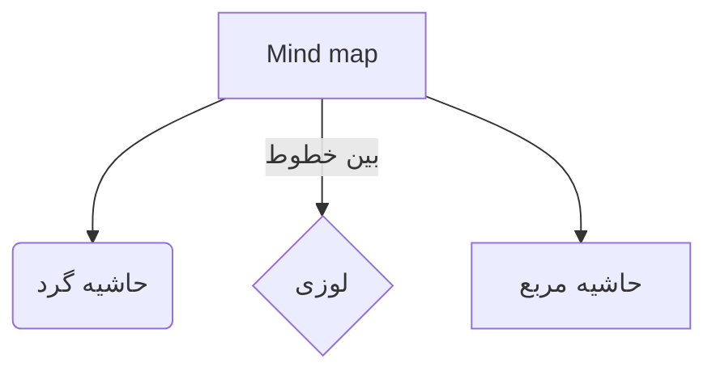

# 📌 Basic Markdown Syntax  
## Heading
- Unordered list  
* Unordered list  
1. Ordered list    
**Bold text**  
*Italic text*  
`Inline code`  
```Code block```  
> Blockquote  

[Link text](../blog/Markdown)  
  
# 📌 Pro Markdown Syntax  
|Column|Column|Column|  
|:---|:---:|---:|  
|Row|Row|Row|  
|Left align|Center align|Right align|  
```html
<details>
<summary>Dropdown example</summary>
This is a dropdown with text!
</details>
```  
---  

> Nice! You should mention mermaid graphs as well! More examples [here](https://mermaid.live/)  
---  
# 📌 علائم پایه در Markdown
# عنوان
- لیست نشانه‌دار
* لیست نشانه‌دار
1. لیست شماره‌دار  
**متن بولد**  
*متن کج*  
`کد inline`  
```کد block```  
> نقل قول  

[متن لینک](../blog/Markdown)  
  
# 📌 علائم پیشرفته در Markdown
|ستون|ستون|ستون|
|:---|:---:|---:|
|ردیف|ردیف|ردیف|
|چپ چین|وسط چین|راست چین|  